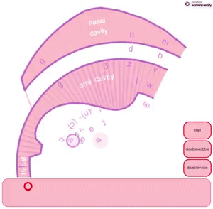
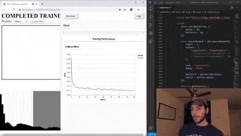
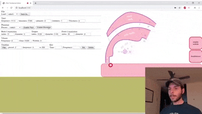
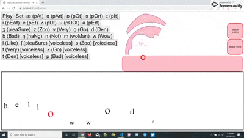
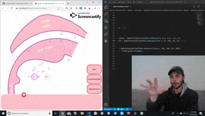
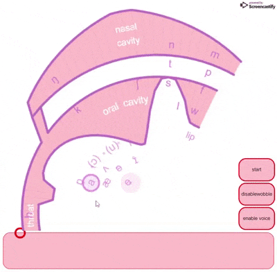

<a href="https://twitter.com/ConcreteSciFi/status/1138555909133594624" target="_blank"></a><br>
_Sound is generated in the glottis (at the bottom left), then filtered by the shape of the vocal tract. The voicebox controls the pitch and intensity of the initial sound_ - [Neil Thapen](http://venuspatrol.nfshost.com/)

# 🗣️ Pink Trombone - Bare-handed Speech Synthesis
_A programmable version of [Neil Thapen's](http://venuspatrol.nfshost.com/) famous and wonderful [Pink Trombone](https://dood.al/pinktrombone/)_

## 📚 Table of Contents
[📦 Setting Up](#-setting-up)

[👄 Producing Sound](#-producing-sound)

[👀 Enabling and Disabling the UI](#-enabling-and-disabling-the-ui)

[🎛️ Audio Parameters](#-audio-parameters)

[🎺 Manipulating Vocal Tract Constrictions](#-manipulating-vocal-tract-constrictions)

[👅 Common Phonemes](#-common-phonemes)

[🏆 Developer Showcase](#-developer-showcase)

[🙏 Developer Wishlist](#-developer-wishlist)

[📖 Bibliography](#-bibliography)

## 📦 Setting Up
1. Save a local copy of [`pink-trombone.min.js`](https://raw.githubusercontent.com/zakaton/Pink-Trombone/master/pink-trombone.min.js) and [`pink-trombone-worklet-processor.min.js`](https://raw.githubusercontent.com/zakaton/Pink-Trombone/master/pink-trombone-worklet-processor.min.js) and make sure they're both in the same relative location (the first will import the other as a [Audio Worklet Processor](https://developers.google.com/web/updates/2017/12/audio-worklet))

2. In your HTML `<head></head>` element, insert the file in a script element as a [module](https://developer.mozilla.org/en-US/docs/Web/JavaScript/Guide/Modules):
```html
<script src="pink-trombone.min.js" type="module"></script>
```

3. In your HTML `<body></body>` element, insert the following custom element:
```html
<pink-trombone></pink-trombone>
```

4. In your JavaScript code, grab the `<pink-trombone></pink-trombone>` element:
```javascript
var pinkTromboneElement = document.querySelector("pink-trombone");
```

5. Add a `load` eventListener to the `pinkTromboneElement` element:
```javascript
pinkTromboneElement.addEventListener("load", myCallback);
```

6. In the `"load"` callback, assign an [Audio Context](https://developer.mozilla.org/en-US/docs/Web/API/AudioContext) using `.setAudioContext(myAudioContext)` (if none is specified, an Audio Context instance is created for you):
```javascript
function myCallback(event) {
  pinkTromboneElement.setAudioContext(myAudioContext)
}
```
This method returns a [Promise](https://developer.mozilla.org/en-US/docs/Web/JavaScript/Reference/Global_Objects/Promise) once the [AudioWorkletProcessor](https://github.com/zakaton/Pink-Trombone/blob/master/script/audio/nodes/pinkTrombone/processors/WorkletProcessor.js) module is loaded.

7. In the [promise resolution](https://developer.mozilla.org/en-US/docs/Web/JavaScript/Reference/Global_Objects/Promise/then), a [Pink Trombone audio node](https://github.com/zakaton/Pink-Trombone/blob/master/script/audio/nodes/pinkTrombone/AudioNode.js) is created, which you can connect to other audio nodes from the scope of the `<pink-trombone></pink-trombone>` element:
```javascript
function myCallback(event) {
  pinkTromboneElement.setAudioContext(myAudioContext)
    .then(() => {
      const audioContext = pinkTromboneElement.audioContext
      pinkTromboneElement.connect(audioContext.destination);
    });
}
```

## 👄 Producing Sound
😃 To start generating sound, run the `.start()` method:
```javascript
pinkTromboneElement.start();
```

🤐 To stop generating sound, run the `.stop()` method:
```javascript
pinkTromboneElement.stop();
```

## 👀 Enabling and Disabling the UI
🙂 To show the interactive visualization:
```javascript
pinkTromboneElement.enableUI();
```
✍️ To start animating the visualization:
```javascript
pinkTromboneElement.startUI();
```

🛑 To stop animating the visualization:
```javascript
pinkTromboneElement.stopUI();
```

😊 To hide the interactive visualization:
```javascript
pinkTromboneElement.disableUI();
```


## 🎛️ Audio Parameters
The [audio parameters](https://developer.mozilla.org/en-US/docs/Web/API/AudioParam) of the [Pink Trombone audio node](https://github.com/zakaton/Pink-Trombone/blob/master/script/audio/nodes/pinkTrombone/AudioNode.js) can be accessed from the `<pink-trombone></pink-trombone>` element's scope:

🎚️ Intensity
```javascript
pinkTromboneElement.intensity;
```
🎵 Frequency
```javascript
pinkTromboneElement.frequency;
```
👄 Tenseness
```javascript
pinkTromboneElement.tenseness;
```
📢 Loudness
```javascript
pinkTromboneElement.loudness;
```
〰️ Vibrato
```javascript
pinkTromboneElement.vibrato.frequency;
pinkTromboneElement.vibrato.gain;
pinkTromboneElement.vibrato.wobble;
```
👅 Tongue
```javascript
// 'index' and 'diameter' refer to the tongue's location in the mouth
pinkTromboneElement.tongue.index;
pinkTromboneElement.tongue.diameter;
```

To change the [voiceness](https://en.wikipedia.org/wiki/Voice_(phonetics)) between voiced and voiceless, change the `.tenseness` and `.loudness` [audio parameters](https://developer.mozilla.org/en-US/docs/Web/API/AudioParam) as follows:
```javascript
function setVoiceness(voiceness) {
  const tenseness = 1 - Math.cos((voiceness) * Math.PI * 0.5);
  const loudness = Math.pow(tenseness, 0.25);
  
  pinkTromboneElement.tenseness.value = tenseness;
  pinkTromboneElement.loudness.value = loudness;
}

// voiced
setVoiceness(1);

// voiceless
setVoiceness(0);
```
_Later on I may add a `.voiceness` [audio parameter](https://developer.mozilla.org/en-US/docs/Web/API/AudioParam) that automates this - for now I'm just adopting the [original version](https://dood.al/pinktrombone/)_

## 🎺 Manipulating Vocal Tract Constrictions
Vocal Tract constrictions comprise of an object containing `.index` and `.diameter` [Audio Parameter](https://developer.mozilla.org/en-US/docs/Web/API/AudioParam) properties that are implicitly connected to the [Pink Trombone audio node](https://github.com/zakaton/Pink-Trombone/blob/master/script/audio/nodes/pinkTrombone/AudioNode.js)

To add a vocal tract constriction:
```javascript
var myConstriction = pinkTromboneElement.newConstriction(indexValue, diameterValue);
```

To set a vocal tract constriction:
```javascript
myConstriction.index.value = newIndexValue;
myConstriction.diameter.value = newDiameterValue;
```

To remove a vocal tract constriction:
```javascript
pinkTromboneElement.removeConstriction(myConstriction);
```

## 👅 Common Phonemes
For reference, here are some preset index & diameter preset values for [some phonemes](http://www.internationalphoneticalphabet.org/ipa-sounds/ipa-chart-with-sounds/):

👅 Tongue phonemes:

æ [pat]
  - index : 14.93
  - diameter : 2.78
  
ɑ [part]
  - index : 2.3
  - diameter : 12.75
  
ɒ [pot]
  - index : 12
  - diameter : 2.05
  
ɔ [port (rounded)]
  - index : 17.7
  - diameter : 2.05
  
ɪ [pit]
  - index : 26.11
  - diameter : 2.87
  
i [peat]
  - index : 27.2
  - diameter : 2.2
  
e [pet]
  - index : 19.4
  - diameter : 3.43
  
ʌ [put]
  - index : 17.8
  - diameter : 2.46
  
u [poot (rounded)]
  - index : 22.8
  - diameter : 2.05
  
ə [pert]
  - index : 20.7
  - diameter : 2.8


🎺 [Vocal Tract Constriction](https://en.wikipedia.org/wiki/Manner_of_articulation) phonemes:
_voiced and voiceless consonants share the same values, differing in [voiceness](https://en.wikipedia.org/wiki/Voice_(phonetics))_

- [Fricatives](https://en.wikipedia.org/wiki/Fricative_consonant)

  - (ʒ, ʃ) ["s" in "pleasure"]
    - index : 31
    - diameter : 0.6
    
  - (z, s) ["z" in "zoo"]
    - index : 36
    - diameter : 0.6
    
  - (v, f) ["v" in "very"]
    - index : 41
    - diameter : 0.5
    
- [Stops](https://en.wikipedia.org/wiki/Stop_consonant)

  - (g, k) ["g" in "go"]
    - index : 20
    - diameter : 0
    
  - (d, t) ["d" in "den"]
    - index : 36
    - diameter : 0
    
  - (b, p) ["b" in "bad"]
    - index : 41
    - diameter : 0

- [Nasals](https://en.wikipedia.org/wiki/Nasal_consonant)

  - (ŋ) ["ng" in "hang"]
    - index : 20
    - diameter : -1
    
  - (n) ["n" in "not"]
    - index : 36
    - diameter : -1
    
  - (m) ["m" in "woman"]
    - index : 41
    - diameter : -1

## 🏆 Developer Showcase
*Send us an email at zack@ukaton.com if you have a cool application made with our api!*  
<a href="https://twitter.com/ConcreteSciFi/status/1565439155131129857?s=20" target="_target"></a>
<br>
<a href="https://twitter.com/ConcreteSciFi/status/1212548283895177216?s=20" target="_target"></a>
<br>
<a href="https://twitter.com/ConcreteSciFi/status/1200218613669449728?s=20" target="_target"></a>
<br>
<a href="https://twitter.com/ConcreteSciFi/status/1189319140231786498?s=20" target="_target"></a>
<br>
<a href="https://twitter.com/ConcreteSciFi/status/1162501265374322688?s=20" target="_target"></a>
<br>
<a href="https://twitter.com/ConcreteSciFi/status/1138555909133594624?s=20" target="_target"></a>
<br>

## 🙏 Developer Wishlist
*Our time is limited, so we'd greatly appreciate it if you guys could implement some of these ideas:*
- [ ] __IPA Speak n' See__ 🗣️💬 - Take input speech from the user using the [Media Recording API](https://developer.mozilla.org/en-US/docs/Web/API/MediaStream_Recording_API) and approximate their articulation using the Pink Trombone, allowing speakers to visualize how they speak.
- [ ] __Phonetic Voice Editor__ 🎹👄⌨️ - Create a cross between a [Text Editor](https://en.wikipedia.org/wiki/List_of_text_editors) and a [Digita Audio Workstation](https://en.wikipedia.org/wiki/Digital_audio_workstation), where the user can type in phonemes instead of characters, with [automation](https://en.wikipedia.org/wiki/Mix_automation) to programmatically adjust the cadence, pitch, and other features over time.
- [ ] __SSML Simulator__ 📝💬 - Implement a [Speech Synthesis Markup Language](https://en.wikipedia.org/wiki/Speech_Synthesis_Markup_Language) emulator that can take an [utterance](https://developer.mozilla.org/en-US/docs/Web/API/SpeechSynthesisUtterance) and process the speech request using Pink Trombone's audio processing

## 📖 Bibliography
- [Julius O. Smith III, "Physical audio signal processing for virtual musical instruments and audio effects."](https://ccrma.stanford.edu/~jos/pasp/)
- [Story, Brad H. "A parametric model of the vocal tract area function for vowel and consonant simulation." 
The Journal of the Acoustical Society of America 117.5 (2005): 3231-3254.](http://sal.arizona.edu/sites/default/files/story_jasa2005.pdf)
- [Lu, Hui-Ling, and J. O. Smith. "Glottal source modeling for singing voice synthesis." 
Proceedings of the 2000 International Computer Music Conference. 2000.](http://citeseerx.ist.psu.edu/viewdoc/download?doi=10.1.1.142.5360&rep=rep1&type=pdf)
- [Mullen, Jack. Physical modelling of the vocal tract with the 2D digital waveguide mesh. 
PhD thesis, University of York, 2006.](http://www-users.york.ac.uk/~dtm3/Download/JackThesis.pdf)
